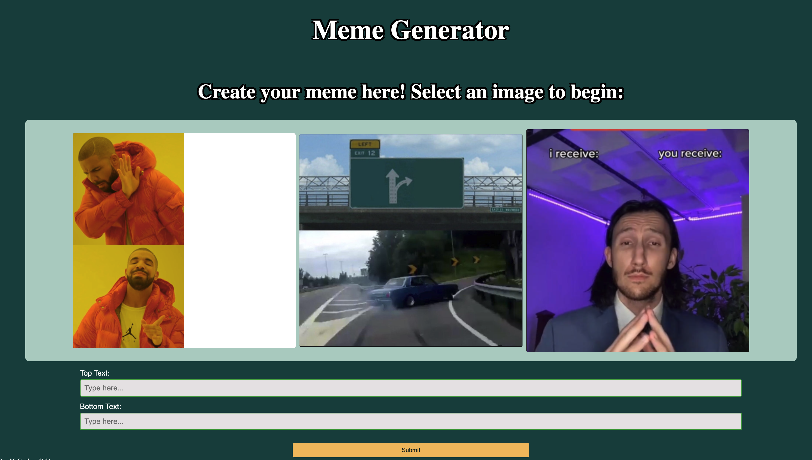
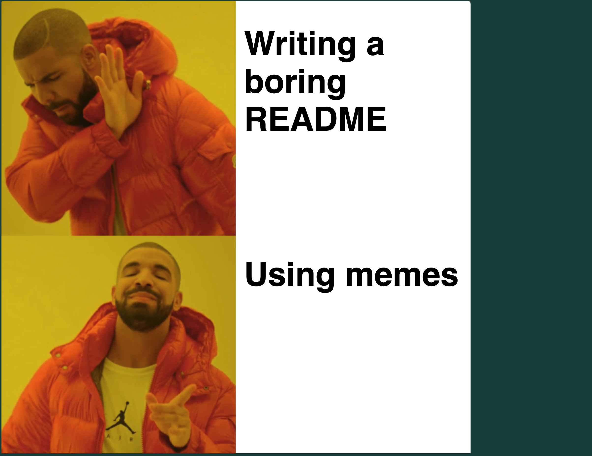
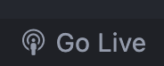
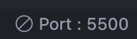
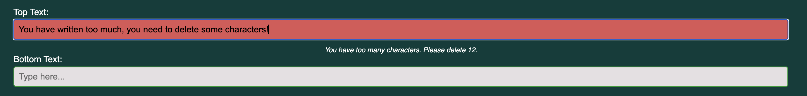
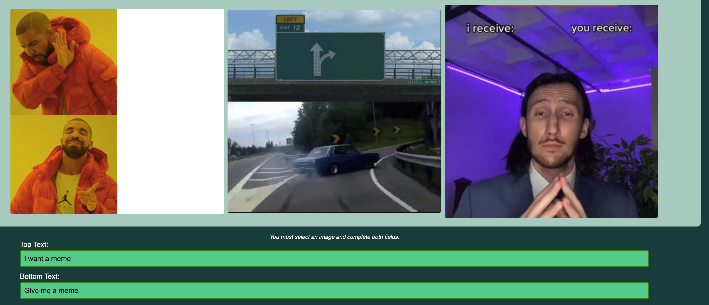

# Meme Generator

## Skills

- **JavaScript**
- **HTML**
- **CSS**
- **Error-Handling**
- **Hosting**
- **Data Validation**
- **Responsive Design**
- **Accessible Design**

## Setup

#### Clone the repository:

> Click the green `Code` button and copy the URL  

#### In your local machine's terminal, run:

> git clone https://github.com/Dimeben/meme-generator.git 

#### Once it has downloaded, run:

> cd /meme-generator  
> code .  

#### Install npm & Node.js by following this link:

[Install npm and Node.js](https://docs.npmjs.com/downloading-and-installing-node-js-and-npm)

> Made using Node.js v22.4.1

#### Install the dependencies by running the following in your terminal:

> npm i

#### Install the live server extension:

> https://marketplace.visualstudio.com/items?itemName=MS-vsliveshare.vsliveshare

#### Then click on go live on the bottom right of your screen:

#### To end the hosting of the app, press :

## Images:

